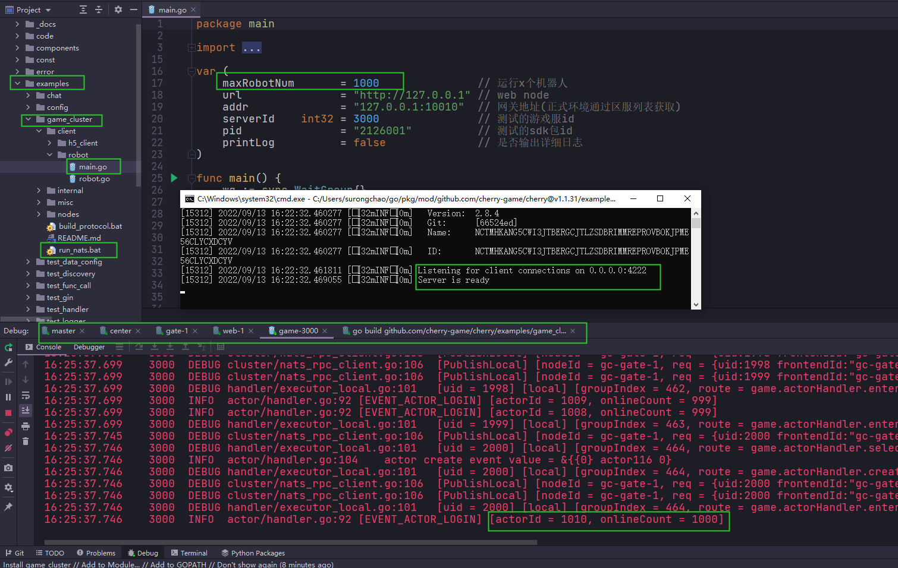

# 多节点示例

## 须知

- 本示例适合作为游戏服务端的基础脚手架，开发者们可在此示例基础上发展出自己的游戏服务端方案。
- 示例中没有使用数据库，进程重启会还原所有数据
- 客户端演示分为两种：
  - `robot_client` 为go实现的游戏压测客户端，使用`tcp/protobuf`协议
  - `nodes/web/view/` 为h5实现的游戏客户端，使用`websocket/protobuf`协议

## 要求

- GO >= 1.18
- nats.io >= 2.0

## 配置

- 参数配置文件在 `../config/demo-cluster.json`
- 策划配置文件在 `../config/data/`

## 准备

- `git clone https://github.com/cherry-game/cherry.git`
- 或者点击github.com页面的`code`按钮`Download zip`下载源码包
- 打开项目源码，找到`demo_cluster`目录
- 请参考[环境安装与配置](https://github.com/cherry-game/cherry/blob/master/_docs/env-setup.md) 进行准备工作

## 启动与调试

### 1、启动nats

> nats为高性能的分布式消息中间件，详情可通过`https://github.com/nats-io/nats-server` 进行了解。
> 本框架中所有节点都基于 nats 进行消息通信。
> 正式环境请使用集群 nats-streaming-server 进行部署 `https://github.com/nats-io/nats-streaming-server`

### 2、启动参数配置

- 找到`demo_cluster/nodes/main.go`，所有节点都从`main.go`启动`gc-master`、`gc-center`、`gc-web-1`、`gc-gate-1`、`gc-game-10001`
- 用户配置启动参数如下：
  - `gc-center`       center --path=./config/demo-cluster.json --node=gc-center
  - `gc-web-1`        web --path=./config/demo-cluster.json --node=gc-web-1
  - `gc-gate-1`       gate --path=./config/demo-cluster.json --node=gc-gate-1
  - `gc-game-10001`   game --path=./config/demo-cluster.json --node=10001


## 测试

- 使用 go 实现客户端，通过 tcp 协议连接 gate 网关进行压力测试
- 使用 h5 实现客户端，通过 websocket 协议连接 gate 网关进行功能的展示

### 启动压测机器人

- 找到`demo_cluster/robot_client/main.go` 文件,并执行
- 机器人执行逻辑为：`注册帐号`，`登陆获取token`、`连接网关`、`用户登录游戏服`、`查看角色`、`创建角色`、`进入角色`
- 默认设定为创建1000个帐号，可自行调整`maxRobotNum`参数进行测试
- 执行完成后，从game节点的`Console`可以查看到`onlineCount = 50000`字样

#### 启动 h5 客户端

- 直接访问`http://127.0.0.1:8081`，按照界面步骤提示操作。
  - 端口以 web 进程打印的具体的值为准，如果发现端口被占用，请搜索并替换。

## 源码讲解
- `internal` 内部业务逻辑
  - `code` 定义一些业务的状态码
  - `component` 组件目录，
    - `check_center`组件, 用于在启动前节点先检查`center`节点是否已启动
  - `constant` 一些常用定义
  - `data` 策划配表包装的struct，用于读取`../config/data`目录的策划配表
  - `event` 游戏事件
  - `guid` 生成全局id
  - `pb` protobuf生成的协议结构
  - `protocol` protobuf结构定义目录
  - `rpc` 跨节点rpc函数封装
  - `session_key` 一些session相关的常量定义
  - `token` 登录token逻辑，包含生成token、验证token
  - `types` 各种自定义类型封装,方便struct从配置文件、数据库读取数据时进行序列化、反序列化

- `nodes` 分布式节点目录
  - `center`节点
  - `game` 节点
  - `gate` 节点
  - `master` 节点
  - `web` 节点(为了演示方便，包含了h5客户端)
- `robot_client` 压测机器人(tcp/protobuf协议)
- `build_protocol.bat` 生成protobuf结构代码到`internal/pb/`目录

### master节点--可以舍弃

- master 节点主要用于实现最基础的发现服务,基于nats构建。
- 正式环境也可配置为etcd方式提供发现服务。
- 相关的代码在`demo_cluster/master/`目录。

### center节点

- center 节点目前主要用于处理帐号相关的业务或全局唯一的业务

### web节点

- web 节点主要对外提供一些http的接口，可横向扩展，多节点部署。
- 目前用于开发者帐号注册、区服列表、sdk登陆/支付回调、验证token生成等业务。

### gate节点

- gate 节点为游戏对外网关，可横向扩展，多节点部署。
- 主要用于管理客户端的连接、消息路由与转发。

### game节点

- game 节点为具体的游戏逻辑业务，根据业务需求可多节点部署。
- 在分服的游戏中可提供游戏内的各种逻辑实现。

## 运行截图



## 常见问题与解答

### 1. 服务发现问题：Gate/Game 节点无法找到 Center 节点

**问题现象**：Center 节点启动正常，但 Gate 和 Game 节点提示找不到 Center 节点，一直重试。

**根本原因**：etcd 组件注册顺序错误，导致服务发现组件在初始化时不可用。

**解决方案**：将 `cherryDiscovery.Register(cherryETCD.New())` 移到 `cherry.Configure()` 之前：

```go
func Run(profileFilePath, nodeID string) {
    // 必须在 cherry.Configure() 之前注册
    cherryDiscovery.Register(cherryETCD.New())
    
    app := cherry.Configure(
        profileFilePath,
        nodeID,
        false,
        cherry.Cluster,
    )
    // ...
}
```

### 2. check_center 组件阻塞问题

**问题现象**：节点启动时卡在 check_center 组件，无法完成初始化。

**根本原因**：在 `OnAfterInit()` 中同步等待应用启动，但此时应用尚未进入运行状态，导致死循环。

**解决方案**：使用 goroutine 异步执行检查逻辑：

```go
func (c *Component) OnAfterInit() {
    go c.waitCenter()
}

func (c *Component) waitCenter() {
    // 等待应用启动
    for !c.App().Running() {
        time.Sleep(100 * time.Millisecond)
    }
    
    // 检查 Center 节点
    for {
        if rpcCenter.Ping(c.App()) {
            break
        }
        time.Sleep(2 * time.Second)
        cherryLogger.Warn("center node connect fail. retrying in 2 seconds.")
    }
}
```

### 3. GetAgent 传参问题

**问题**：为什么 `GetAgent(p.ActorID(), 0)` 第二个参数传 0？

**解答**：`GetAgent` 函数优先使用第一个参数（SID）查找，只有当 SID 为空时才使用第二个参数（UID）：

```go
func GetAgent(sid string, uid cfacade.UID) (*Agent, bool) {
    if sid != "" {
        return GetAgentWithSID(sid)  // 优先用 SID
    }
    if uid > 0 {
        return GetAgentWithUID(uid)
    }
    return nil, false
}
```

- `p.ActorID()` 返回的是 SID，不为空，所以第二个参数 `0` 是占位符，不会被使用。
- 传 `session.Uid` 是为了双重保险：先用 SID 找，找不到再用 UID 找。

### 4. 功能划分：Gate vs Game 节点

| 特性 | Gate 节点 | Game 节点 |
|-----|-----------|-----------|
| 网络连接管理 | 负责 | 不负责 |
| 会话管理 | 负责 | 不负责 |
| 消息路由转发 | 负责 | 不负责 |
| 安全验证 | 负责（token验证） | 不负责 |
| 游戏逻辑处理 | 不负责 | 负责 |
| 玩家状态管理 | 不负责 | 负责 |
| 数据库操作 | 不负责 | 负责 |

**经验法则**：
- 如果功能涉及**网络连接、会话管理、简单验证** → 放在 Gate
- 如果功能涉及**玩家数据、游戏逻辑、复杂计算** → 放在 Game

### 5. 区服分配机制

Gate 层可以根据用户的区服 ID 将玩家分配到不同的 Game 节点：

1. **登录时选择区服**：客户端发送 `LoginRequest` 时携带 `serverId`
2. **保存到 Session**：Gate 将 `serverId` 保存到 session 中
3. **消息路由**：后续消息根据 session 中的 `serverId` 路由到对应的 Game 节点

```go
// 登录时保存区服 ID
agent.Session().Set(sessionKey.ServerID, cstring.ToString(req.ServerId))

// 消息路由时使用
serverId := session.GetString(sessionKey.ServerID)
targetPath := cfacade.NewChildPath(serverId, "player", childId)
```

### 6. login 和 setSession 的调用顺序

**调用顺序**：`login` → `setSession`

1. **login**：客户端登录时调用，验证身份并绑定 uid
2. **setSession**：玩家进入游戏后，由 Game 节点远程调用，设置 session 中的玩家属性

```
客户端登录 → login() → 验证 token → 绑定 uid → 返回结果
玩家进入游戏 → Game 节点调用 setSession() → 设置 PlayerID 等属性
```

### 7. Agent 创建时机

**Agent 在客户端建立连接时创建**：

```go
agentActor.SetOnNewAgent(func(newAgent *pomelo.Agent) {
    childActor := &ActorAgent{}
    newAgent.AddOnClose(childActor.onSessionClose)
    agentActor.Child().Create(newAgent.SID(), childActor) // actorID == SID
})
```

创建流程：
1. 客户端连接到 Gate 节点
2. pomelo 连接器创建 `Agent` 对象
3. 创建对应的 `ActorAgent`，并以 SID 作为 actorID
